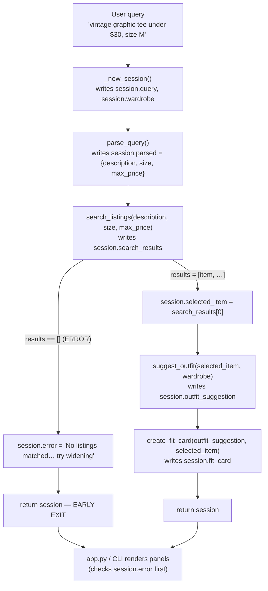

# FitFindr — planning.md

> Complete this document before writing any implementation code.
> Your spec and agent diagram are what you'll use to direct AI tools (Claude, Copilot, etc.) to generate your implementation — the more specific they are, the more useful the generated code will be.
> Your planning.md will be reviewed as part of your submission.
> Update it before starting any stretch features.

---

## Tools

List every tool your agent will use. For each tool, fill in all four fields.
You must have at least 3 tools. The three required tools are listed — add any additional tools below them.

### Tool 1: search_listings

**What it does:**
Searches the 40-item mock listings dataset (`data/listings.json`) and returns the listings that best match the user's described item, optionally narrowed by size and a price ceiling. It is a deterministic, **local keyword-scoring** search — no LLM — that ranks each listing by how many query keywords overlap its `title`, `description`, `style_tags`, and `category`.

**Input parameters:**
- `description` (str, required): Free-text keywords describing the wanted item, e.g. `"vintage graphic tee"`. Tokenized and matched against each listing's text fields to compute a relevance score.
- `size` (str | None): Size filter, e.g. `"M"`. Case-insensitive **substring** match against the listing's `size` field, so `"M"` matches `"S/M"`. `None` skips size filtering.
- `max_price` (float | None): Inclusive price ceiling in dollars. Listings with `price > max_price` are excluded. `None` skips price filtering.

**What it returns:**
A `list[dict]` of full listing records, **sorted by relevance score, highest first**; an empty list if nothing matches (it never raises). Each dict contains: `id` (str), `title` (str), `description` (str), `category` (str — tops/bottoms/outerwear/shoes/accessories), `style_tags` (list[str]), `size` (str), `condition` (str — excellent/good/fair), `price` (float), `colors` (list[str]), `brand` (str | None), `platform` (str — depop/thredUp/poshmark).

**What happens if it fails or returns nothing:**
Returns `[]` rather than raising. The planning loop checks for the empty list, sets `session["error"]` to an actionable message that echoes the filters back (e.g. *"No listings matched 'vintage graphic tee' under $30 in size M — try removing the size filter, raising your max price, or using broader keywords."*), and **returns early without calling `suggest_outfit` or `create_fit_card`**.

---

### Tool 2: suggest_outfit

**What it does:**
Takes the selected thrifted item plus the user's wardrobe and asks the Groq LLM to propose 1–2 complete outfits that style the new item with pieces the user already owns. If the wardrobe is empty, it instead asks the LLM for general styling guidance for the item on its own.

**Input parameters:**
- `new_item` (dict): A listing dict (the chosen item, `session["selected_item"]`). The prompt is built from its `title`, `category`, `colors`, `style_tags`, and `description`.
- `wardrobe` (dict): A wardrobe dict shaped `{"items": [ {id, name, category, colors, style_tags, notes}, ... ]}`. The `items` list may be empty.

**What it returns:**
A **non-empty** `str` of natural-language outfit suggestions — 1–2 looks, each naming the new item and specific wardrobe pieces *by name* (e.g. *"Pair it with your baggy straight-leg jeans and chunky white sneakers, then layer the vintage black denim jacket on top."*). When the wardrobe is empty it returns general advice (which categories, colors, and vibes pair well) instead of referencing owned pieces.

**What happens if it fails or returns nothing:**
An empty wardrobe is **not** an error — the empty-`items` branch returns general styling advice. The Groq call is wrapped in `try/except`; if it raises or returns a blank string, the tool returns a short rule-based fallback built from the item's `category` + `colors` (e.g. *"Style this black graphic tee as the statement piece with neutral basics and chunky sneakers."*) so the loop can still continue to `create_fit_card`. It never returns an empty string.

---

### Tool 3: create_fit_card

**What it does:**
Turns the outfit suggestion and item details into a short (2–4 sentence) casual, shareable social caption (OOTD style). It runs the Groq LLM at a **higher temperature (~0.9)** so the caption reads differently for different inputs, and mentions the item name, price, and platform once each.

**Input parameters:**
- `outfit` (str): The outfit-suggestion text returned by `suggest_outfit()` (`session["outfit_suggestion"]`).
- `new_item` (dict): The selected listing dict — used for `title`, `price`, and `platform` in the caption.

**What it returns:**
A `str` caption of 2–4 sentences in a casual, authentic voice (not a product description). If `outfit` is empty or whitespace, it returns a **descriptive error string** instead of a caption (e.g. *"Couldn't generate a fit card — no outfit suggestion was provided."*).

**What happens if it fails or returns nothing:**
Guards an empty/whitespace `outfit` up front and returns the descriptive error string (never raises). If the LLM call itself fails, it catches the exception and returns a simple template caption assembled from the item fields (e.g. *"Thrifted this Graphic Tee — 2003 Tour Bootleg Style for $24 on depop. 🖤"*) so the user always gets something shareable.

---

### Additional Tools (if any)

None for the core build — the three required tools cover the full search → style → share pipeline. A `parse_query(query)` helper (see Planning Loop) extracts `description` / `size` / `max_price` from the raw query, but it is an internal parsing step inside the planning loop rather than a standalone agent tool.

---

## Planning Loop

**How does your agent decide which tool to call next?**

FitFindr runs a **fixed, linear pipeline** (search → suggest → card) with exactly **one early-exit branch** — the empty-search-results case. Each tool runs at most once per query; there is no open-ended "pick any tool" loop. `run_agent(query, wardrobe)` executes these steps in order:

1. **Initialize:** `session = _new_session(query, wardrobe)`.

2. **Parse the query** with `parse_query(query)` (regex + string parsing):
   - `max_price`: match `under $30`, `below 30`, `$30`, `< 30` → `30.0`; else `None`.
   - `size`: match `size M`, `in M`, or a standalone size token (`XS`–`XXL`, numeric shoe sizes, `W30`) → that string; else `None`.
   - `description`: the query with the matched price/size phrases stripped out, used as keywords.
   - **Branch:** if `description` is empty after stripping, fall back to the raw `query` as the description (never search on an empty string).
   - Store `{description, size, max_price}` in `session["parsed"]`.

3. **Search:** `results = search_listings(description, size, max_price)`; store in `session["search_results"]`.
   - **Branch on `len(results)`:**
     - **If `results == []`** → set `session["error"]` to a specific no-results message (echoing the parsed filters and suggesting fixes) and **`return session` immediately**. Do **not** call `suggest_outfit` or `create_fit_card`.
     - **Else** → continue.

4. **Select:** `session["selected_item"] = results[0]` (the top-ranked match).

5. **Suggest outfit:** `outfit = suggest_outfit(session["selected_item"], session["wardrobe"])`; store in `session["outfit_suggestion"]`. No early-exit branch here — `suggest_outfit` always returns a usable string (empty wardrobe → general advice), so the loop proceeds unconditionally.

6. **Create fit card:** `card = create_fit_card(session["outfit_suggestion"], session["selected_item"])`; store in `session["fit_card"]`.

7. **Return** `session`.

**How does it know it's done?** The loop terminates when either (a) the empty-results branch returns early with `session["error"]` set, or (b) all three tools have run and `session["fit_card"]` is populated with `session["error"]` still `None`. Consumers (`app.py`, the CLI) always check `session["error"]` first.

---

## State Management

**How does information from one tool get passed to the next?**

All state lives in a single **session dict** created by `_new_session(query, wardrobe)` — it is the one source of truth for the run. Each tool's output is written into a named session field, and the next tool reads from that field (not from a loose local variable). This keeps the run inspectable end-to-end and lets `app.py` / the CLI read the final fields directly.

| Field | Type | Written by | Read by |
|-------|------|------------|---------|
| `query` | str | `_new_session` (init) | `parse_query` |
| `parsed` | dict `{description, size, max_price}` | Step 2 parse | `search_listings` call |
| `search_results` | list[dict] | `search_listings` | empty-check + `selected_item` |
| `selected_item` | dict \| None | Step 4 (`= search_results[0]`) | `suggest_outfit`, `create_fit_card` |
| `wardrobe` | dict | `_new_session` (init) | `suggest_outfit` |
| `outfit_suggestion` | str \| None | `suggest_outfit` | `create_fit_card` |
| `fit_card` | str \| None | `create_fit_card` | final output panel |
| `error` | str \| None | empty-results branch | **checked first** by `app.py` / CLI |

**Flow:** `parsed` → `search_listings` → `search_results` → `selected_item` → `suggest_outfit` → `outfit_suggestion` → `create_fit_card` → `fit_card`. On the error path only `error` is set and the remaining output fields stay `None`. Consumers must check `session["error"]` before reading `selected_item` / `outfit_suggestion` / `fit_card`.

---

## Error Handling

For each tool, describe the specific failure mode you're handling and what the agent does in response.

| Tool | Failure mode | Agent response |
|------|-------------|----------------|
| search_listings | No results match the query | Stop the pipeline before any LLM call. Set `session["error"]` to a specific, actionable message that echoes the parsed filters and offers concrete fixes — e.g. *"No secondhand listings matched 'vintage graphic tee' under $30 in size M. Try removing the size filter, raising your price ceiling, or using broader keywords like 'graphic tee'."* Return the session so the UI shows this in panel 1 and leaves the outfit / fit-card panels empty. |
| suggest_outfit | Wardrobe is empty | Not a hard failure. Detect `wardrobe["items"] == []` and return **general styling guidance** instead of named pairings — e.g. *"You haven't added wardrobe pieces yet, so here's how to style this black graphic tee: pair it with baggy or wide-leg bottoms and chunky sneakers, and let it be the statement piece."* The pipeline continues to `create_fit_card` normally. (If the LLM call errors, a `try/except` returns a short rule-based fallback so the run still completes.) |
| create_fit_card | Outfit input is missing or incomplete | Guard up front: if `outfit` is empty/whitespace, return a plain descriptive string — *"Couldn't generate a fit card — no outfit suggestion was available. Here's the listing on its own: Graphic Tee — 2003 Tour Bootleg Style, $24 on depop."* — instead of raising. If the LLM call fails, fall back to a simple template caption built from the item's title/price/platform so the user still gets a shareable line. |

---

## Architecture

```text
        User query  ("vintage graphic tee under $30, size M")
              │
              ▼
   ┌──  PLANNING LOOP  (run_agent)  ───────────────────────────────────────────
   │
   │   _new_session(query, wardrobe)
   │        │  writes → session.query, session.wardrobe
   │        ▼
   │   parse_query(query)
   │        │  writes → session.parsed = {description, size, max_price}
   │        ▼
   │   search_listings(description, size, max_price)
   │        │  writes → session.search_results   (ranked list[dict])
   │        │
   │        ├─ results == []  ─►  session.error = "No listings matched… try widening"
   │        │                            │
   │        │                            ▼
   │        │                     return session  ─────────►  EARLY EXIT ──┐
   │        │                                                              │
   │        └─ results = [item, …]                                         │
   │                 │  writes → session.selected_item = search_results[0]  │
   │                 ▼                                                      │
   │   suggest_outfit(selected_item, wardrobe)                             │
   │        │  writes → session.outfit_suggestion   (str)                  │
   │        ▼                                                              │
   │   create_fit_card(outfit_suggestion, selected_item)                   │
   │        │  writes → session.fit_card   (str)                           │
   │        ▼                                                              │
   │   return session  ─────────────────────────────────────────────────────┤
   │                                                                        │
   └────────────────────────────────────────────────────────────────────────┘
                                      │
                                      ▼
            app.py handle_query / CLI   (reads session.error FIRST)
              • success → selected_item ▸ panel 1 · outfit_suggestion ▸ panel 2 · fit_card ▸ panel 3
              • error   → error message ▸ panel 1 · panels 2 & 3 empty
```



---

## AI Tool Plan

**Milestone 3 — Individual tool implementations:**

- **`search_listings` — GitHub Copilot (in-editor).**
  *Input:* the Tool 1 block above (four fields, with the three params and the exact return-dict fields) plus the `load_listings()` docstring from [utils/data_loader.py](utils/data_loader.py).
  *Expect:* a deterministic function that filters by `max_price` and `size` first, scores remaining listings by keyword overlap across `title` / `description` / `style_tags` / `category`, drops score-0 items, sorts descending, and returns the dicts.
  *Verify before trusting:* (1) read the code to confirm it filters by **all three** params and calls `load_listings()`; (2) confirm it returns `[]` — not `None`, no exception — on no match; (3) run 3 queries — `"vintage graphic tee"` (expect `lst_006` ranked first), `"90s track jacket"` size `"M"` (expect `lst_004`), `"designer ballgown size XXS under $5"` (expect `[]`).

- **`suggest_outfit` — Claude.**
  *Input:* the Tool 2 block, the wardrobe item fields from [data/wardrobe_schema.json](data/wardrobe_schema.json), one example listing dict, and the `_get_groq_client()` helper already in [tools.py](tools.py).
  *Expect:* the empty-vs-non-empty `wardrobe["items"]` branch, a Groq prompt that names specific wardrobe pieces, and a `try/except` fallback.
  *Verify:* (1) empty wardrobe returns general advice and never `""`; (2) non-empty wardrobe references pieces by name; (3) run once with `get_example_wardrobe()` and once with `get_empty_wardrobe()` and read both outputs.

- **`create_fit_card` — GitHub Copilot.**
  *Input:* the Tool 3 block (style guidelines: casual voice, name/price/platform once each, temperature ~0.9), a sample outfit string, and a sample item dict.
  *Expect:* an empty-`outfit` guard returning the descriptive error string, plus a Groq call at higher temperature.
  *Verify:* (1) `outfit=""` returns the error string, not an exception; (2) the caption mentions title, price, and platform exactly once; (3) call twice with the same item and confirm the captions differ; (4) output is 2–4 sentences.

**Milestone 4 — Planning loop and state management:**

- **`run_agent` + `parse_query` — Claude.**
  *Input:* the Planning Loop section, the State Management table, the Architecture diagram (ASCII **and** Mermaid), and the `_new_session()` / `run_agent()` docstrings from [agent.py](agent.py).
  *Expect:* `run_agent()` implemented exactly as the diagram shows — init → `parse_query` → `search_listings` → empty-results branch (set `error`, return early) → `selected_item = results[0]` → `suggest_outfit` → `create_fit_card` → return — plus a `parse_query()` that regex-extracts `max_price` and `size` and uses the remainder as `description`.
  *Verify against the spec:* (1) happy path `"vintage graphic tee under $30"` populates `parsed`, `search_results`, `selected_item`, `outfit_suggestion`, and `fit_card`, with `error is None`; (2) no-results path `"designer ballgown size XXS under $5"` stops right after `search_listings` with `error` set and `outfit_suggestion` / `fit_card` still `None` (add a temporary print to confirm the downstream tools are **not** called); (3) confirm the empty-results branch is the only early `return`. Then wire `handle_query()` in [app.py](app.py) and click each example query in the Gradio UI.

---

## A Complete Interaction (Step by Step)

**Example user query:** "I'm looking for a vintage graphic tee under $30. I mostly wear baggy jeans and chunky sneakers. What's out there and how would I style it?"

**Step 1 — parse + search.**
`_new_session()` stores the query and wardrobe. `parse_query()` extracts `description="vintage graphic tee"`, `max_price=30.0`, `size=None` and writes them to `session["parsed"]`. The loop calls `search_listings("vintage graphic tee", size=None, max_price=30.0)`, which filters out anything over $30, scores the rest on keyword overlap, and returns a ranked `list[dict]`. `lst_002` (Y2K Baby Tee, $18) also matches, but the `"graphic tee"` + `"vintage"` overlap across both title and description ranks **`lst_006` "Graphic Tee — 2003 Tour Bootleg Style"** ($24, depop, good condition, size L) first. The list goes to `session["search_results"]`. Branch: results are non-empty, so `session["selected_item"] = search_results[0]` (`lst_006`) and the loop proceeds.

**Step 2 — suggest outfit.**
The loop calls `suggest_outfit(session["selected_item"], session["wardrobe"])` with `lst_006` and the example wardrobe. The LLM returns a styling string that pairs the tee with the user's **baggy straight-leg jeans (w_001)** and **chunky white sneakers (w_007)**, optionally layering the **vintage black denim jacket (w_006)**. The string is stored in `session["outfit_suggestion"]`. (If the wardrobe had been empty, this step would still return general styling advice rather than an error.)

**Step 3 — create fit card.**
The loop calls `create_fit_card(session["outfit_suggestion"], session["selected_item"])`. At a higher temperature it returns a 2–4 sentence casual caption that names the item, "$24," and "depop" once each, stored in `session["fit_card"]`. The loop returns the completed session with `error = None`. *(Error path: had `search_listings` returned `[]` in Step 1, the loop would have set `session["error"]` to the no-results message and returned right there — Steps 2 and 3 would never run.)*

**Final output to user:**
`app.py handle_query()` checks `session["error"]` (here `None`), then renders the three panels: **panel 1** the matched listing (title, price, platform, condition, size from `selected_item`), **panel 2** the `outfit_suggestion` built from the user's own wardrobe, and **panel 3** the ready-to-post `fit_card` caption.
